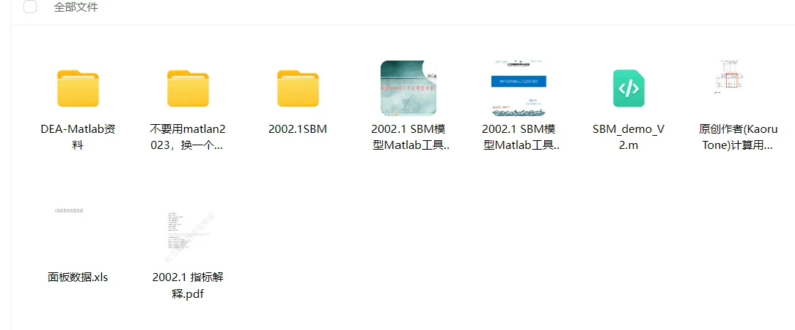
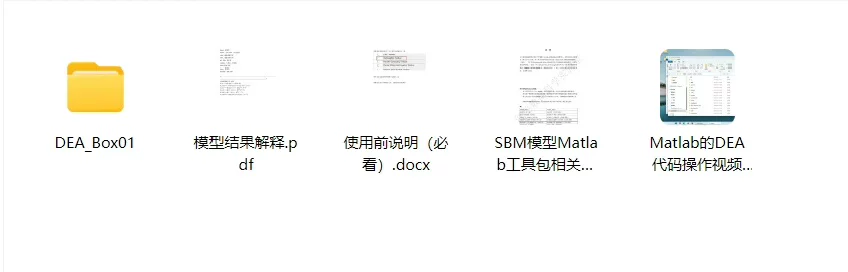

## Body

SBM Model, Super-SBM (Super Efficiency) Model Code

Measurable Non-Expected, Measurable Index Decomposition Value
The materials include Matlab code, detailed video teaching files and example data, as well as deap software, which can calculate the ordinary DEA model.
The service content only includes the sharing of materials, excluding Q&A. For Q&A, please click on the Q&A link.

## Images

Here is a pay link on Stripe ( https://buy.stripe.com/3cs8yP7sY87d0vu9AB ). Please contact me lonlonago@foxmail.com after funding $89, and I will send you a complete data files , thank you!

